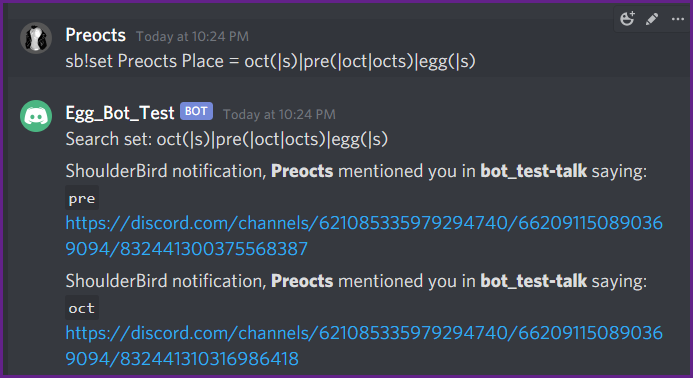
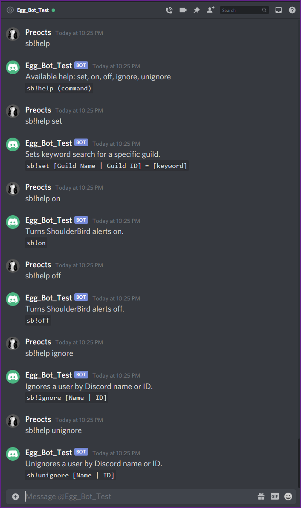

# ShoulderBird Module v1.0.0

### Keyword pings, because sleep is not an option.

ShoulderBird is the answer to "Can I get a ping when someone says [whatever] in the chat so that I'm aware?  The answer, my friends, is yes. Yes you can.

ShoulderBird works on a simple search that scans all chat that the bot can see for a keyword that is defined per user. A user, through direct message command line options, can set their own search for any guild that the bot is active in.  Once set, the bot will check that search against any `onmessage` events seen in the guild.

Additionally, before relaying the message with a link, ShoulderBird will ensure the user being pinged is actually a member of the given channel.

Fair warning, I'm aware that this might not scale gracefully. This was designed for a single guild with what I would call a slow chat input. How this will handle even a dozen guilds with mild to moderate chat activity is beyond my testing ability at this time.



---

## Direct Message Commands:

*Open to anyone who can interact with the bot*

`sb!help (command)`
- A short version of help for `set`, `on`, `off`, `ignore`, `unignore`

`sb!on`
- Turns ShoulderBird on for *all* guilds a user has set a search in

`sb!off`
- Turns ShoulderBird off for *all* guilds a user has set a search in

`sb!set [guildName | guildID] = [keyword]`
- Sets a search for the given guild.
- The guild can be the guild's name (case sensitive) or the guild's ID.

`sb!ignore [Username | UserID]`
- Add a user to be ignored by ShoulderBird across all guilds the user has a search in.
- UserName is not the user's nickname, is case sensitive, and excludes the #0000 postfix.

`sb!unignore [Username | UserID]`
- Removes a user from the ignore list in ShoulderBird across all guilds the user has a search in.
- UserName is not the user's nickname, is case sensitive, and excludes the #0000 postfix.

---

## Okay, but how does the keyword part work?

ShoulderBird scans incoming messages and uses a simple regex expression which is word-bound to find matches. The `keyword` for the search can be customized with `(`, `)`, and `|` regex operators. All other non-ascii characters are escaped on save of the keyword.

If your nickname in a chat is, for example, "Egg" and you want to be pinged when anyone says your nickname then you can start with a basic regex search:

```
sb!set MyGuild_Name = preocts
```

This should work for most applications of the module. For those that wish to go deeper, the available regex operators allows for some fun pattern matching on the keyword.

```
sb!set MyGuild_Name = oct(|s)|pre(|oct|octs)|egg(|_bot|bot)
```

*Keep in mind that all keywords are case agnostic.*

---

## Image of help being used in direct message:


